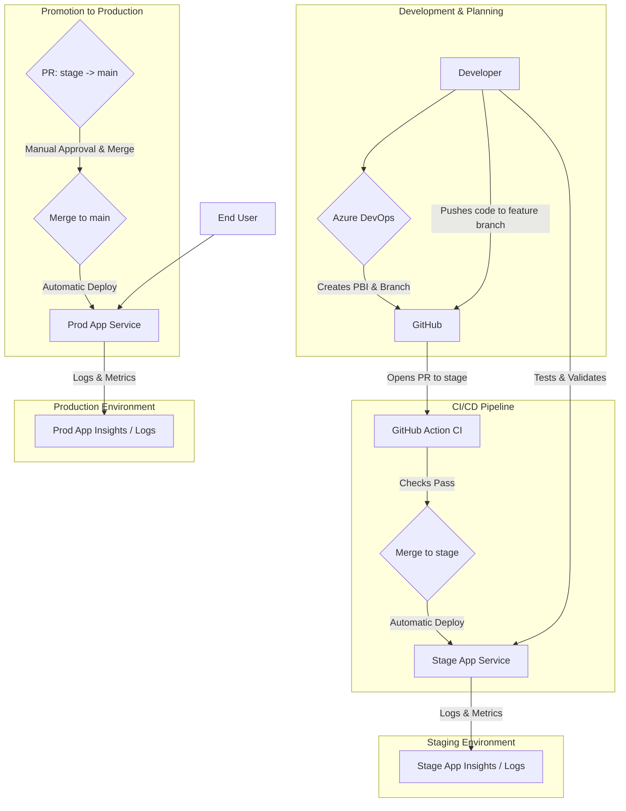

# Architecture Overview

This document outlines the architecture for the Picky application. It covers the development workflow tools, the Azure infrastructure components, the deployment flow, and the monitoring strategy for both staging and production environments.

## Core Components

The architecture is composed of several key components working together:

-   **Application**: A Python Flask web application that serves a simple frontend (HTML, CSS, JS) and provides a backend API for data management.
-   **Source Control & CI/CD**:
    -   **GitHub**: Hosts the source code. It's the single source of truth for the codebase and is used for version control, branching (`feature` -> `stage` -> `main`), and Pull Requests.
    -   **GitHub Actions**: Provides Continuous Integration (CI) by automatically running quality checks (like linting and testing) on every Pull Request before it can be merged into the `stage` branch.
    -   **Azure App Service (Deployment Center)**: Provides Continuous Deployment (CD) by monitoring the `stage` and `main` branches in GitHub. Changes merged to these branches are automatically deployed to the corresponding environment.
-   **Data Storage**:
    -   **Azure Cosmos DB**: The application uses Azure Cosmos DB for persistent, scalable data storage across all environments. This provides reliable data persistence and supports automatic scaling based on demand.

## Environments

To ensure stability and quality, the project uses two parallel environments: Staging and Production. Each environment is a complete, isolated stack of the necessary Azure resources.

### Staging Environment

-   **Purpose**: To test and validate new features in a production-like environment before they are released to end-users.
-   **Deployment Trigger**: Automatic deployment is triggered upon every merge to the **`stage`** branch.
-   **Azure Resources**:
    -   App Service Plan (Staging)
    -   App Service (Staging)
    -   Application Insights (Staging)
    -   Log Analytics Workspace (Staging)

### Production Environment

-   **Purpose**: The live application that is used by end-users.
-   **Deployment Trigger**: Automatic deployment is triggered upon every merge to the **`main`** branch (which happens when a PR from `stage` is approved).
-   **Azure Resources**:
    -   App Service Plan (Production)
    -   App Service (Production)
    -   Application Insights (Production)
    -   Log Analytics Workspace (Production)

## Workflow and Infrastructure Diagram

This diagram illustrates the flow from development planning through to production deployment.

## Monitoring & Logging

Each environment has its own dedicated Application Insights and Log Analytics Workspace. This isolation is critical for preventing staging data from interfering with production metrics.

-   **Application Insights** is our Application Performance Management (APM) tool. It is used to:
    -   Track application performance (server response times, failure rates, etc.).
    -   Automatically detect and diagnose exceptions and performance issues.
    -   Understand user behavior through telemetry.

-   **Log Analytics Workspace** serves as the central repository for all log data. It collects and stores:
    -   All telemetry data from Application Insights.
    -   Infrastructure-level logs from the Azure App Service (e.g., web server logs, deployment logs).
    -   This allows for powerful, cross-cutting queries to troubleshoot complex issues.
