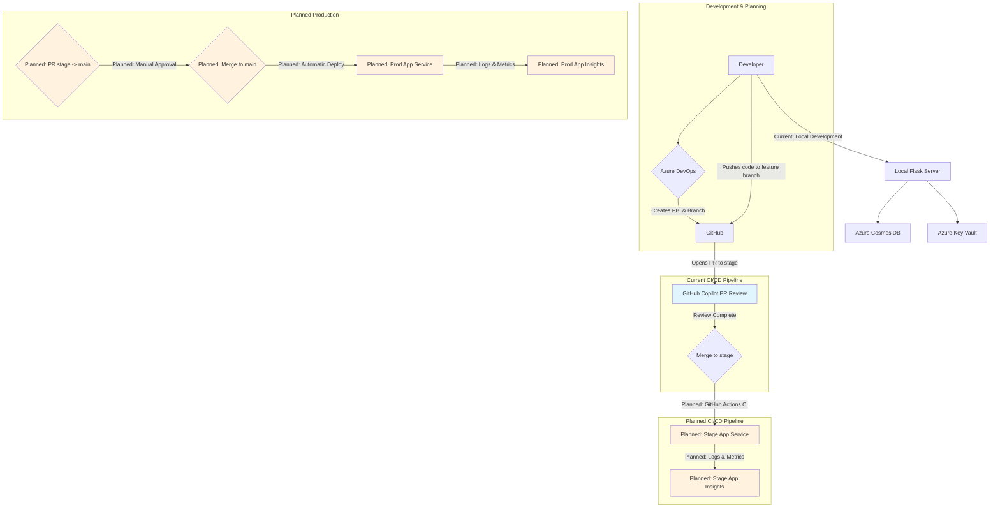

# Architecture Overview

This document outlines the architecture for the Picky application. It covers the development workflow tools, the Azure infrastructure components, the deployment flow, and the monitoring strategy for both staging and production environments.

## Core Components

The architecture is composed of several key components working together:

-   **Application**: A Python Flask web application that serves a simple frontend (HTML, CSS, JS) and provides a backend API for data management. The app manages three item types: larder items, shopping items, and meals.
-   **Source Control & CI/CD**:
    -   **GitHub**: Hosts the source code. It's the single source of truth for the codebase and is used for version control, branching (`feature` -> `stage` -> `main`), and Pull Requests.
    -   **GitHub Copilot PR Review**: Currently configured on GitHub.com to automatically review Pull Requests when opened.
    -   **GitHub Actions**: *Planned* - Will provide Continuous Integration (CI) by automatically running quality checks (like linting and testing) on every Pull Request before it can be merged into the `stage` branch.
    -   **Azure App Service (Deployment Center)**: *Planned* - Will provide Continuous Deployment (CD) by monitoring the `stage` and `main` branches in GitHub. Changes merged to these branches will be automatically deployed to the corresponding environment.
-   **Data Storage**:
    -   **Azure Cosmos DB**: The application uses Azure Cosmos DB for persistent, scalable data storage across all environments. This provides reliable data persistence and supports automatic scaling based on demand.
    -   **Azure Key Vault**: Secure credential management for Cosmos DB connection strings and other secrets.

## Environments

The project is designed to support multiple environments with proper isolation and deployment strategies.

### Development Environment (Current)

-   **Purpose**: Local development and testing.
-   **Deployment**: Manual local execution.
-   **Data Storage**: Azure Cosmos DB with environment-specific containers.
-   **Authentication**: Azure Key Vault with `az login` authentication.

### Staging Environment (Planned)

-   **Purpose**: To test and validate new features in a production-like environment before they are released to end-users.
-   **Deployment Trigger**: *Planned* - Automatic deployment will be triggered upon every merge to the **`stage`** branch.
-   **Azure Resources** (Planned):
    -   App Service Plan (Staging)
    -   App Service (Staging)
    -   Application Insights (Staging)
    -   Log Analytics Workspace (Staging)

### Production Environment (Planned)

-   **Purpose**: The live application that is used by end-users.
-   **Deployment Trigger**: *Planned* - Automatic deployment will be triggered upon every merge to the **`main`** branch (which happens when a PR from `stage` is approved).
-   **Azure Resources** (Planned):
    -   App Service Plan (Production)
    -   App Service (Production)
    -   Application Insights (Production)
    -   Log Analytics Workspace (Production)

## Workflow and Infrastructure Diagram

This diagram illustrates the current and planned flow from development planning through to production deployment.

## Monitoring & Logging

### Current State
-   **Local Development**: Basic logging via Python logging module
-   **Database Health**: Built-in health check endpoint (`/api/health`) for Cosmos DB connection status

### Planned Monitoring & Logging
Each environment will have its own dedicated Application Insights and Log Analytics Workspace. This isolation is critical for preventing staging data from interfering with production metrics.

-   **Application Insights** will be our Application Performance Management (APM) tool. It will be used to:
    -   Track application performance (server response times, failure rates, etc.).
    -   Automatically detect and diagnose exceptions and performance issues.
    -   Understand user behavior through telemetry.

-   **Log Analytics Workspace** will serve as the central repository for all log data. It will collect and store:
    -   All telemetry data from Application Insights.
    -   Infrastructure-level logs from the Azure App Service (e.g., web server logs, deployment logs).
    -   This allows for powerful, cross-cutting queries to troubleshoot complex issues.
